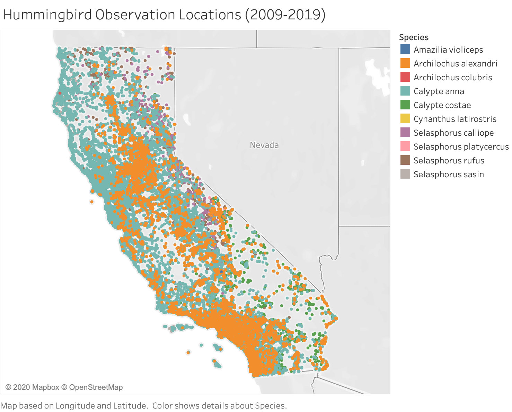

# Hummingbird Observation Predictor (California) 

___
###### Using Classification Modeling to Analyze and Predict Hummingbird Observations in California
____
##### Summary Media
[Presentation](https://docs.google.com/presentation/d/1Qzs5-P3c_Zl_fo20sSHyWCWdhS4qnKJfyNV1qKWUnoU/edit?usp=sharing)
[Dashboard](https://github.com/sierrah154/Final_Project-Aves/tree/main/dashboard)

##### Table of Contents

* [Collaboration Framework](#collaboration-framework)
  * [Communication Protocol](#communication-protocol)
  * [Distribution of Tasks](#distribution-of-tasks)
* [Project Vision](Presentation/Project_Vision.png)
* [Questions](#Questions)
* [Data Exploration and Analysis](#data-exploration-and-analysis)
  * [Sourcing Data](#sourcing-data)
  * [ETL Process](#etl-process)
  * [Database](#database)
* [Machine Learning](#machine-learning)
* [Dashboard and Images](#dashboard-and-images)
* [Requirements](#requirements)
* [Data Citations](#data-citations)
____

### Collaboration Framework

#### Communication Protocol

Our team met on Monday and Wednesday each week via Zoom. We had additional Zoom meetings as needed throughout the week, depending on discussions needed. Lastly, we had a follow-up meeting via Slack or Zoom each Sunday to ensure all required fields had been met for each Segment Due Date.

#### Distribution of Tasks

**Sierra**  [GitHub Repository](https://github.com/sierrah154/Final_Project-Aves.git) & [Presentation Slide Deck](https://docs.google.com/presentation/d/1Qzs5-P3c_Zl_fo20sSHyWCWdhS4qnKJfyNV1qKWUnoU/edit?usp=sharing)

**Cristina** [Machine Learning](#machine-learning) & [Hummingbird Predictor](https://youtu.be/-utiJOYKQVk)

**Catherine** [Database](#database) & [Dashboard](dashboard/Aves_dash_with_predictor.png)

____

### Project Vision

[Project Vision](*.png from Presentation folder*)

Our project vision stemmed from our common interest in Ecology- a branch of biology concerning the spatial and temporal patterns of the distribution and abundance of organisms, including the causes and consequences.

From the beginning, we knew we wanted to utilize the eBird online database. The online database was developed by The Cornell Lab of Ornithology to provide scientists, researchers and amateur naturalists with real-time data about bird distribution and abundance.

Once we started looking at the data available, we realized we needed to narrow the scope of our project. We narrowed it down to California, since we all have an association with the state, and hummingbirds, since they are known to be especially susceptible to environmental conditions.

With these variables in mind, we started to ask questions...

___

### Questions

* What drives hummingbirds to be at these observed locations?
* What environmental variables may play a role?
  * Is there a relationship between air quality and hummingbird observations, specifically in California?
  * Do weather events impact hummingbird observations?
* Are there non-environmental variables that play a role?

[Go to Top](#hummingbird-observation-predictor-californiabrdiv-aligncenter)
____
### Data Exploration and Analysis
#### Sourcing Data
- Gathered csv data files for bird observations from Cornell Lab of Ornithology and obtained through the Global Biodiversity Information Facility.
- Deciding the scope of the data. The initial bird observation in California file was over 47 mil rows.
  After considering which birds that are native to California and may be more susceptible to air quality factors,
  I requested datasets for the 14 observed species of hummingbirds in California for the last ten years. This dataset
  produced over 1.3 million rows.
- The air quality data was taken from pre-generated daily reports from the United States Environmental Protection Agency.
- Weather event data was gathered from the National Oceanic and Atmospheric Administration.
- County population data was gathered from the California Association of Counties.
- Our bird observation data was based on a geographic location and the remaining data was based on counties in California. In order to join, an API call on the Federal Communications Commission was done to gather the county name based on location. Over 93,000 locations were run through the API one at a time.

#### ETL Process
- CSV files from the gathered data were loaded and cleaned using Jupyter Notebook, Python and Pandas.
- Jupyter notebook was used for the API call on the FCC for the county JSON entry.
- For data load see: [eBird](data_load/Ebirds_Data_Load.ipynb), [air quality](data_load/Air_Quality_Data_Load.ipynb), [counties](data_load/counties.ipynb)
- Resulting CSVs exported from Jupyter Notebook were loaded into Amazon S3 for access by the team.
- Google Colab and Pyspark were used to read the csv files into DataFrames and prepared for transfer to the database.
- For Colab file see: [colab](database/aves.py)

#### Database
- Created a ERD with Quick Diagram for the database. [See ERD](database/QuickDBD-export.png)
- Created the tables in PGAdmin and tied to a RDS instance in AWS. [See Schema](database/schema.sql)
- Colab Notebook and Pyspark were used to read the dataframes into RDS and viewed with PGAdmin.
- The tables were joined together based on date and county/location data to tie air quality, weather events, and population to the counties where the hummingbirds were observed.
- Further work in the database was done using PGAdmin.

[Go to Top](#hummingbird-observation-predictor-californiabrdiv-aligncenter)
___

### Machine Learning
##### Description of data preprocessing
- Data was imported into Jupyter Notebook using SQLAlchemy from Postgres database. Once imported we used Python/Pandas to merge a population of counties from 2009-2019. After the data was fully merged any irrelevant features were dropped. Checked the data for any null values. Converted “none” to zeros and numeric. Using the label encoder function we converted the rest of the data into numeric features.

##### Description of feature engineering and the feature selection, including the team's decision-making process.
- Feature selection was made by deciding if features were related to the questions we wanted to answer. Miscellaneous variables were dropped in the initial cleaning of datasets using SQL. Features that were synonymous were also dropped such as “category” which classified the AQI so we decided to just keep AQI. Using matplotlib we created a correlation matrix to compare the features. We found that the features were not heavily correlated so no more features need to be dropped.

##### Description of how data was split into training and testing sets
- Data will have the Y value as the bird species and the X will be the remaining features. Testing and training will be performed using sklearn.model_selection.

##### Explanation of model choice, including limitations and benefits
- Decided on a supervised machine learning model because we wanted to classify our categorical data so that our model is able to predict a bird species based on an input of features. We used a Logistic Regression model to perform the prediction because the outcome of the training and testing accuracy scores were high. Logistic Regression is a great model to use when classifying categorical data.

##### Explanation of changes in model choice (if changes occurred between the Segment 2 and Segment 3 deliverables)
- Originally we had decided on using the Decision Tree model because it’s accuracy score was the highest but because this model begins to over fit we decided to use Logistic Regression model which had an accuracy score that was very similar.

##### Description of how model was trained (or retrained, if they are using an existing model)
- Trained using sklearn. Scaled using Standard Scaler prior to training. Y value is bird species and X value is the remaining 8 features.

##### Description and explanation of model’s confusion matrix, including final accuracy score
- According to the model’s confusion matrix which can be found in the “Model-notebook.ipynb” the scores show that the species with a higher amount of observations have the higher scores. The model is able to predict various species but because certain species are more common those will be favored in the prediction since they are the most likely bird to be observed. The overall accuracy score of the Logistic regression model was testing: 0.720 and the accuracy score for the training: 0.719. For future analysis it would be interesting to see what the top observed hummingbirds would predict or the opposite and see how the rarer species compare.

[Go to Top](#hummingbird-observation-predictor-californiabrdiv-aligncenter)
___

### Dashboard and Images

Tableau was used to create a few images as a part of our data analysis. For the dashboard, there is an image of it here
[Aves Dashboard](dashboard/Aves_dash_with_predictor.png) and a video of the working predictor here on Youtube: [Aves Dashboard Video](https://youtu.be/-utiJOYKQVk).

The Data that was analyzed was from hummingbird observations that were user recorded through the eBird app in California from 2009-2019. These observations were spread throughout the state.

The data showed that there was a growing trend in use of the eBird app over 2009-2019 in California as we can see in the increase in observations.

The eBird data was compared with air quality data from the EPA by comparing AQI measures and categories in the same county as the bird observation on the same day. The growth trend continued in observations on days with a Good AQI, but we did not see the trend continue on days with Unhealthy AQIs.

___

##### Requirements
Python 3.7
  JSON
  pandas
  pathlib
  glob
  requests

Google Colab
  findspark
  os
  from pyspark.sql import SparkSession
  from pyspark.sql.types import StructField, StringType, IntegerType, StructType, LongType, FloatType
  from pyspark import SparkFiles

[Go to Top](#hummingbird-observation-predictor-californiabrdiv-aligncenter)
___

###### Data Citations
Global Biodiversity Information Facility, Citation GBIF.org (10 October 2020) GBIF Occurrence Download https://doi.org/10.15468/dl.2rhbnh
Global Biodiversity Information Facility, Citation GBIF.org (10 October 2020) GBIF Occurrence Download https://doi.org/10.15468/dl.fsvwgj
Environmental Protection Agency, Daily Summaries, https://aqs.epa.gov/aqsweb/airdata/download_files.html#Daily
National Oceanic and Atmospheric Administration, Storm Events Database, https://www.ncdc.noaa.gov/stormevents/choosedates.jsp?statefips=6%2CCALIFORNIA#
Federal Communication Commission (FCC), Census Block for Developers, https://geo.fcc.gov/api/census/#!/block/get_block_find
California Association of Counties, Data and Research, https://www.counties.org/data-and-research